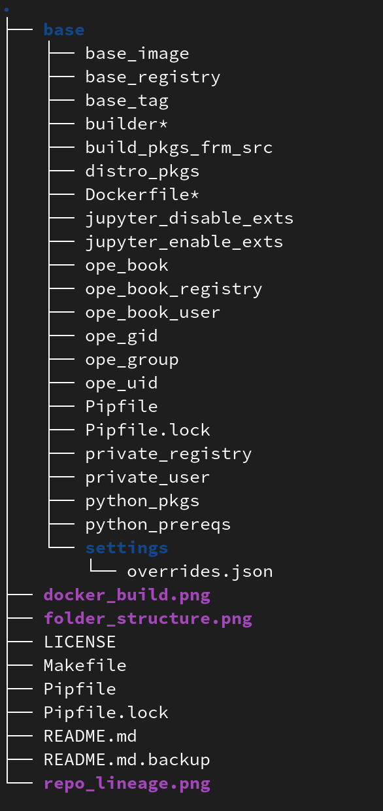

# Getting started

This quick reference guide shows how to leveraging this repo to customize the [source-to-image](https://github.com/openshift/source-to-image) jupyter notebook builder image for OpenDatahub JupyterHub. This branch creates a fedora based s2i builder image for the jupyter container that takes the [textbook content](https://github.com/jappavoo/UndertheCovers) and generate a new image which can be deployed in ODH environment. 

>**_Note:_** This container is only a template and does not contain the textbook content.

## Anatomy of the branch

We have the base directory that includes files like requirements, and other configurations required during the build step. The layout of this branch looks like: 
  

- base: 
    * To configure base image: **<base_registry>/<base_image>:<base_tag>**
     [base_registry](.base/base_registry)
     [base_image](.base/base_image)
     [base_tag](.base/base_tag)
   * To specify system and python libraries:
     [python_prereqs](.base/python_prereqs)
     [python_pkgs](.base/python_pkgs)
     [jupyter_enable_etxs](.base/jupyter_enable_etxs)

- makefile -defines the set of commands/targets to run against the base image, described in the user guide.

## User Guide

### Makefile - targets
This repo utilizes make tool to efficiently build, run, tag and publish the jupyter notebook s2i builder image. 
- build - builds the custom s2i builder image
- push - push current build to private registry
- publish - push the current private build to public registry
- root - executes the private image as root user
- ope - executes the private image with root shell
- nb - starts published version with jupyter notebook interface
- lab - starts published version with jupyter lab interface
### Adding python packages
&nbsp;S2i framework uses [micropipenv](https://github.com/thoth-station/micropipenv) a pip wrapper tool to manage the python library installation. The requirements file generated using micropipenv should be updated in the repository to include additional python libraries. 

  Follow the steps to generate requirements.txt using micropipenv [here](https://github.com/AbiShanna/Ope-Documentation/tree/main/micropipenv).

### Adding system libraries
[Distribution packages](.base/distro_pkgs) listed here installs the system libraries during the build time.
### Jupyter extensions to be enabled
The list of jupyter extensions to be enabled can be updated in the [extensions](.base/jupyter_enable_exts) file.
### Launching in desktop
To run the published public image in your local workstation that has docker running, 
- Clone the git repository
- Checkout branch fedora/ubuntu based on the requirement
- In the parent directory execute 
     * 'make nb' to launch the classic jupyter notebook interface
     * 'make lab' to launch the jupyter lab interface

